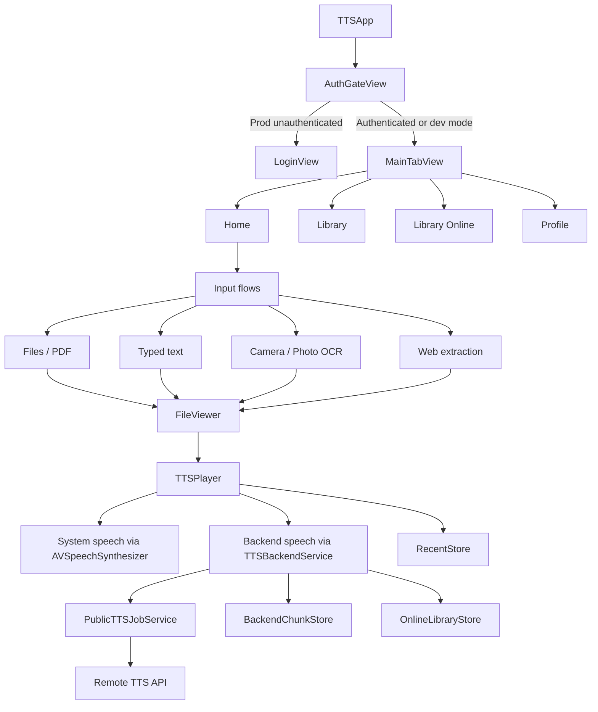
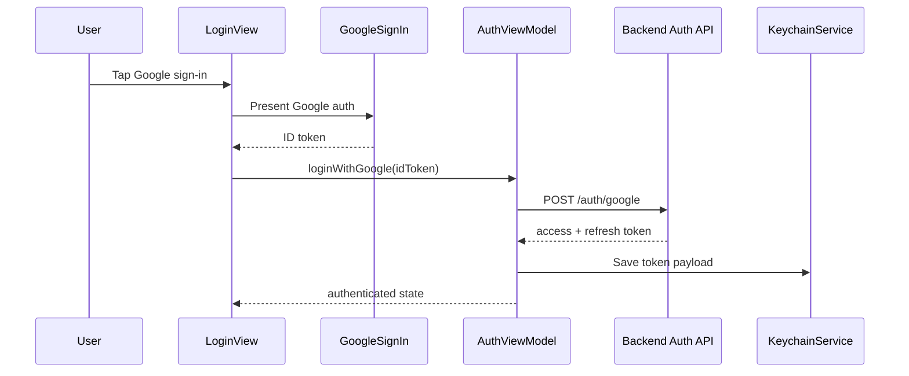
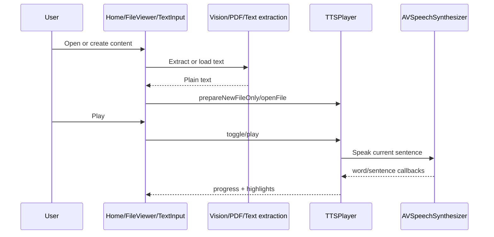
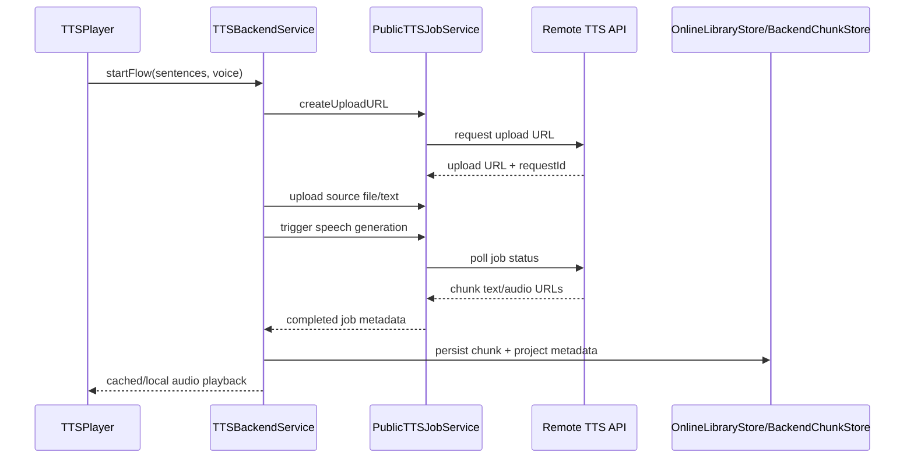

# Architecture

## High-Level Architecture

### Facts
- The app is a single iOS client codebase with feature-folder organization.
- It combines local-first processing with optional backend-assisted speech generation.
- State is shared through SwiftUI environment objects and singleton-style services/stores.

## Module Layout

### App Shell
- `TTS/App`
  - App entry and app delegate
- `TTS/Features/App Entry`
  - Authenticated shell, tabs, modal routing

### Core
- `TTS/Core/Constants`
  - URLs, endpoints, asset names, keys, symbols
- `TTS/Core/Helpers`
  - Text normalization, language detection, tokenization
- `TTS/Core/Models`
  - Playback, voice, recents, enums, configuration
- `TTS/Core/Services`
  - Auth persistence, networking, recents, backend chunk persistence, backend TTS orchestration
- `TTS/Core/TTS`
  - `TTSPlayer`

### Features
- `Features/Auth`
  - Login, auth gating, Google auth view models
- `Features/Home`
  - Input source launcher and recent list surface
- `Features/Reader`
  - OCR, text entry, web extraction, highlighting, document helpers
- `Features/FileViewer`
  - Unified viewer shell and playback controls for opened content
- `Features/Library`
  - Local recent items and online project library
- `Features/Profile`
  - Account info, terms, privacy, about
- `Features/Downloader`
  - Audio generation/download helpers used by playback controls

### Shared UI / Utilities
- `TTS/Shared`
  - Common UI widgets, player views, bottom sheets, utilities, logging, image picker, browser/share helpers

## Major Responsibilities

### `AuthViewModel`
- Exchanges Google ID tokens for backend tokens
- Refreshes sessions with retry/backoff
- Loads/saves tokens in Keychain
- Publishes authentication state for the app shell

### `GoogleAuthViewModel`
- Talks to GoogleSignIn SDK
- Validates nonce
- Hydrates `SettingsProvider`

### `TTSPlayer`
- Owns the playback state machine
- Splits text into sentences and tokens
- Controls play/pause/seek/skip
- Tracks highlighting state
- Switches between system and backend voice modes

### `TTSBackendService`
- Manages remote job lifecycle
- Downloads and caches chunked audio
- Restores persisted remote project playback
- Coordinates backend playback with `TTSPlayer`

### `PublicTTSJobService`
- Creates upload URLs
- Uploads source files/text
- Polls job status
- Downloads chunk text artifacts
- Persists transcript files

### `VoiceCatalog`
- Loads local system voices
- Fetches remote voices and languages
- Merges, sorts, caches, and exposes the unified voice catalog

### `RecentStore`
- Persists local activity history
- Stores bookmarks for external files
- Generates thumbnails and some word-count metadata

### `OnlineLibraryStore`
- Persists metadata for backend-generated projects
- Groups items into projects for the online library UI

## Data Flow

### Auth Flow

### Local Reading Flow

### Backend Speech Flow

## Design Patterns Present

### Facts
- Feature-folder organization
- MVVM-style view/view-model split in auth
- Singleton/shared-store pattern for several services (`APIClient`, `VoiceCatalog`, `OnlineLibraryStore`, `BackendChunkStore`)
- Environment object dependency injection for app-wide state
- Coordinator-like object for text highlighting (`HighlightCoordinator`)
- Programmatic Core Data model definitions rather than `.xcdatamodeld`

## External Integrations

### Facts
- Google Sign-In
- Backend auth API at `https://api.theaudiothor.com`
- Backend TTS API at `http://68.183.127.122:8282`
- Privacy policy / terms / website external URLs

## Deployment Architecture

### Facts
- This repo only contains the iOS client.
- There are separate dev and production app targets/schemes.

### Assumptions / Inferences
- Distribution is likely done through standard Xcode/iOS signing and App Store or ad hoc workflows outside this repository.
- No release automation or CI deployment pipeline is present in-repo.

## Architectural Constraints

### Facts
- The app shell expects `AuthViewModel`, `VoiceCatalog`, `TTSPlayer`, and store objects to be long-lived shared state.
- Local and backend TTS must continue to coexist because UI and playback controls are written around both modes.
- Backend-generated artifacts are persisted across multiple stores:
  - chunk metadata in Core Data
  - online library metadata in JSON
  - generated text/audio files in app-managed file locations
